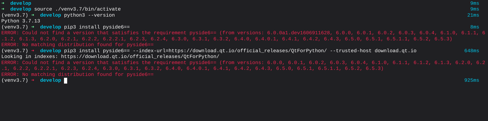
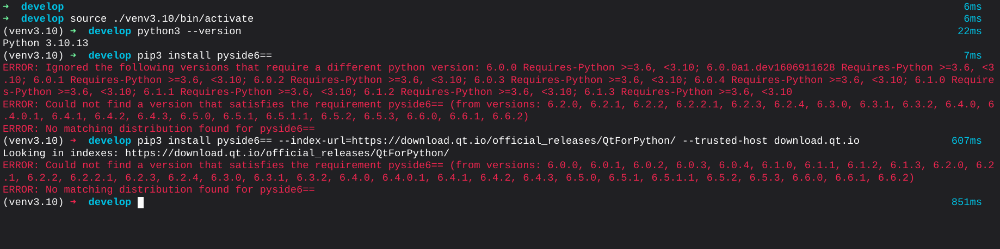
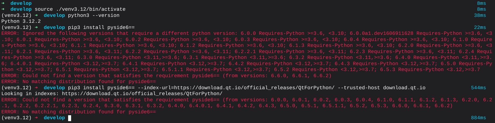
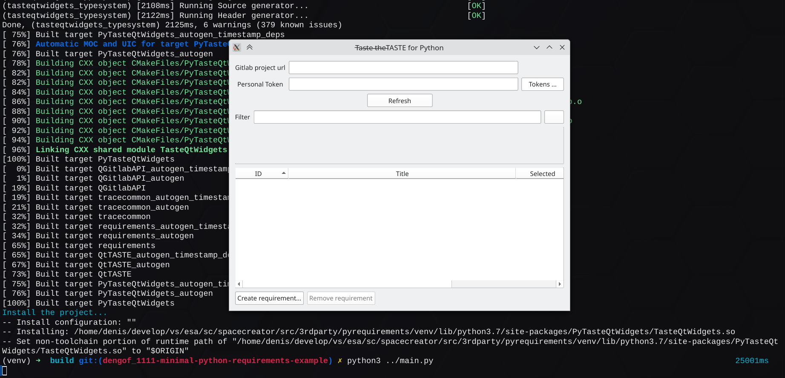

# How to build Python bindings to the TASTE's requirements management library

## Using a script to do it automatically

### Prerequisites

Have Python3 and PySide installed.  
PySyde is needed to use detect the correct version of PySide and Qt.

### Do the installation

Run the `install.py` script with python3.

All required libraries, models, source will be loaded. The module will be built. And the result is placed in the a directory next to the detected PySide. Probably somewhere like `~/.local/lib/python3.10/site-packages/PyTasteQtWidgets`. Depending on your python version.


## Doing it manually

In case the `install.py` script fails, or you want to learn how to build it, here the manual installation.

### Prerequisites

Ensure you have the C++ development environment configured. Depending on the OS, you may need to install the `LLVM`, `Clang`, and `Python` development packages:

```shell
sudo apt install llvm-13 llvm-13-dev libclang-13-dev clang-13
sudo apt install python3.12-dev
```

### 0. Find out the supported Python and Qt version combinations.

At the time of writing, `PySide6` is limited to Python versions [3.6; 3.12). At the same time, `PySide`, `Shiboken`, and all their related parts (PySide Addons, Essentials, and Shiboken generator) must be linked to the same Qt version. Supposing you already have the Qt development environment installed and configured, finding a version of Python that supports it might be challenging because of the binary compatibility of published builds. The example code below refers to `Python 3.7.13` and `Qt 6.4.2`.

Prebuilt binaries could be installed from two different sources: the pip's default and the Qt's repository. To find which versions are stored in the repo, run `pip3 install pkg_name==`:

```shell
pip3 install pyside6==
# or
pip3 install shiboken6-generator== --index-url=https://download.qt.io/official_releases/QtForPython/ --trusted-host download.qt.io
```







Also you may want to look in the Qt snapshots repo: [https://download.qt.io/snapshots/ci/pyside/\[Qt version\]/latest/](https://download.qt.io/snapshots/ci/pyside/6.6/latest/pyside6/)

Sometimes, a package of the necessary version/build might be missing in one repo, but exists in another — it is OK to install that as well.

If you have strict requirements for a particular combination of versions that is missing in the public repositories, you could build `PySide6` from sources. But that's a whole different story not covered here.

When you find the right combination of Python and Qt versions:

### 1. Create and activate Python's virtual environment

```shell
virtualenv --python=python3.7 ./venv
source ./venv/bin/activate
```

Indeed, you can use the globally installed Python, but that's an easy way to get into a mess.

### 2. Install `PySide6` and `Shiboken6-generator`

```shell
pip3 install pyside6==6.4.2
pip3 install shiboken6-generator==6.4.2 --index-url=https://download.qt.io/official_releases/QtForPython/ --trusted-host download.qt.io
```

You may try to specify just the `Major.Minor` version pair to advance the search limits.

### 3. Configure the build specifying the target Qt version

```shell
mkdir build && cd "$_"
cmake .. -DCMAKE_PREFIX_PATH="~/Qt/6.4.2/gcc_64/"
```

If you omit the path to the Qt, the first one found system-wide will be used.

At the end of the configuring process, `CMake` will print the target path and name of the module:

```shell
…
-- Resulting Python module to be installed: ./venv/lib/python3.7/site-packages/PyTasteQtWidgets
…
```

### 4.0. (Optional)

During the build, the `shiboken6-generator` will be used. It is linked to the libraries provided by `PySide6`. Depending on your environment configuration, the path to the libraries might be missing, so you may need to update it manually:
```shell
export LD_LIBRARY_PATH="/path/to/venv/lib/python3.7/site-packages/PySide6/Qt/lib:$LD_LIBRARY_PATH"
```

#### 4.1. Build and install the library as a Python module

```shell
make -j$(nproc --all)
make install
```

## Run the example

```python
import sys

from PySide6.QtWidgets import QApplication
from PyTasteQtWidgets import TasteQtWidgets as QtTaste  # after PySide!


if __name__ == "__main__":

    app = QApplication(sys.argv)

    url = ""
    manager = QtTaste.RequirementsManager()
    model = QtTaste.RequirementsModelBase()

    widget = QtTaste.RequirementsWidget(url, manager, model)
    widget.setWindowTitle("TASTE for Python")
    widget.resize(640, 480)    

    widget.show()

    sys.exit(app.exec())
```

```shell
python3 ../main.py
```

